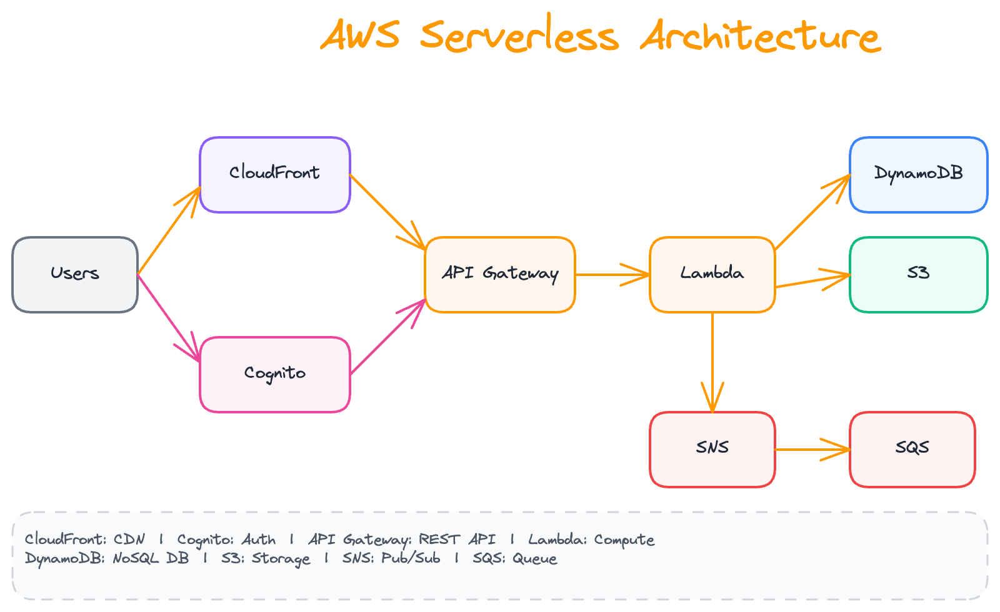
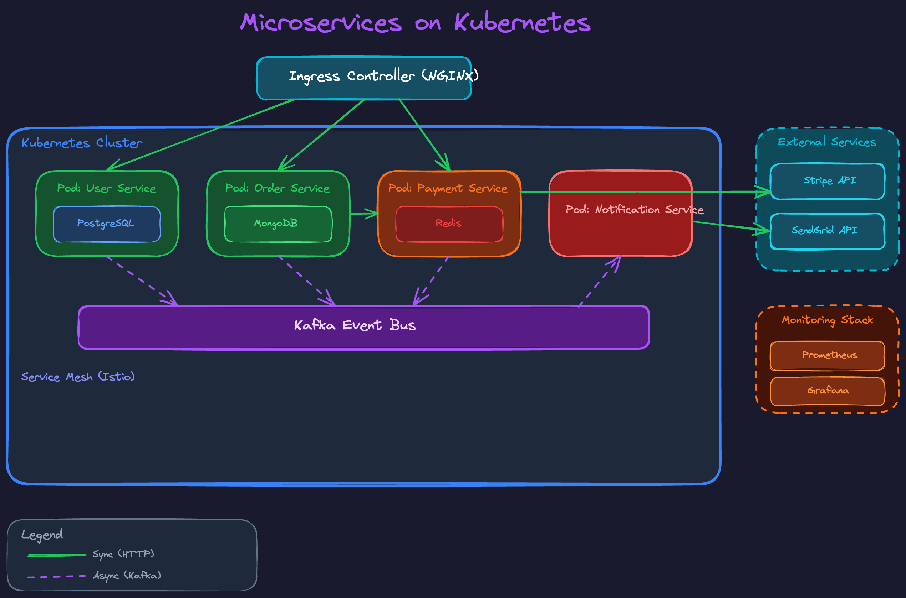
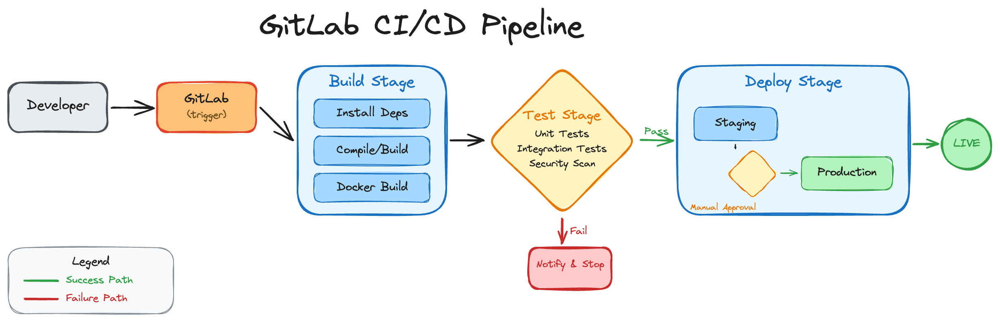
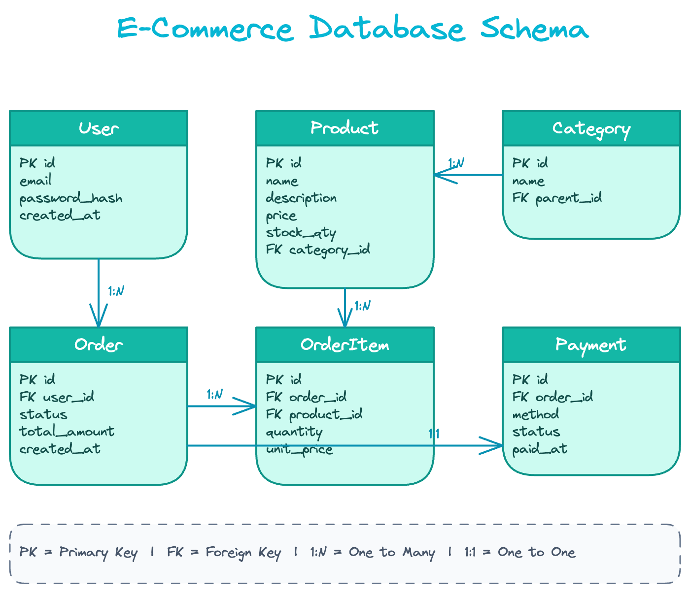
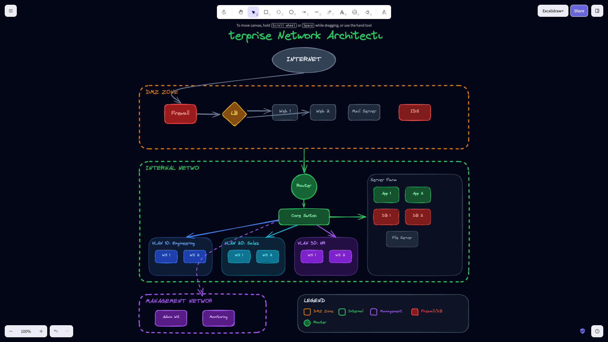
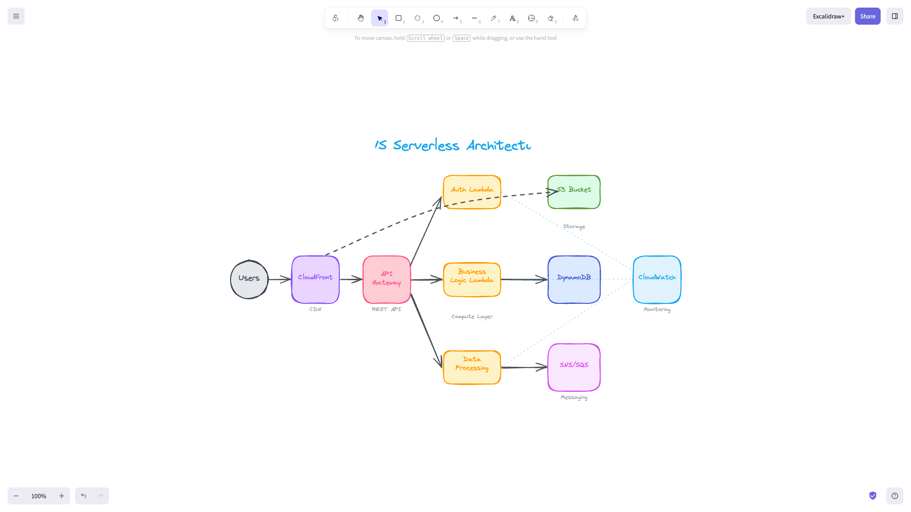
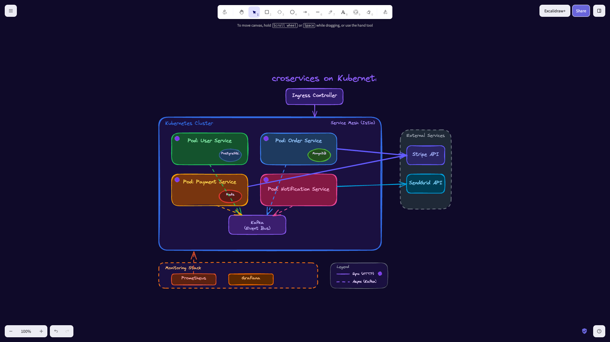
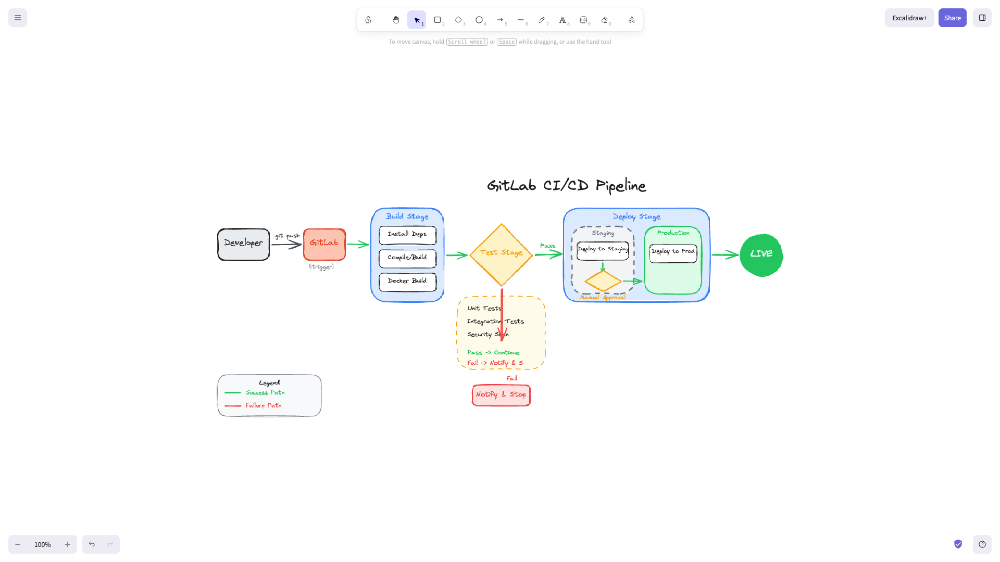
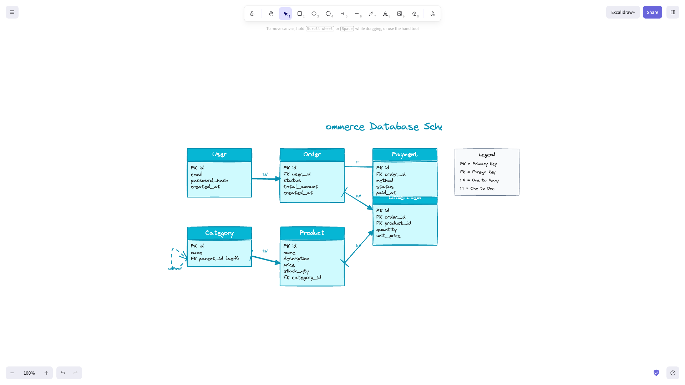
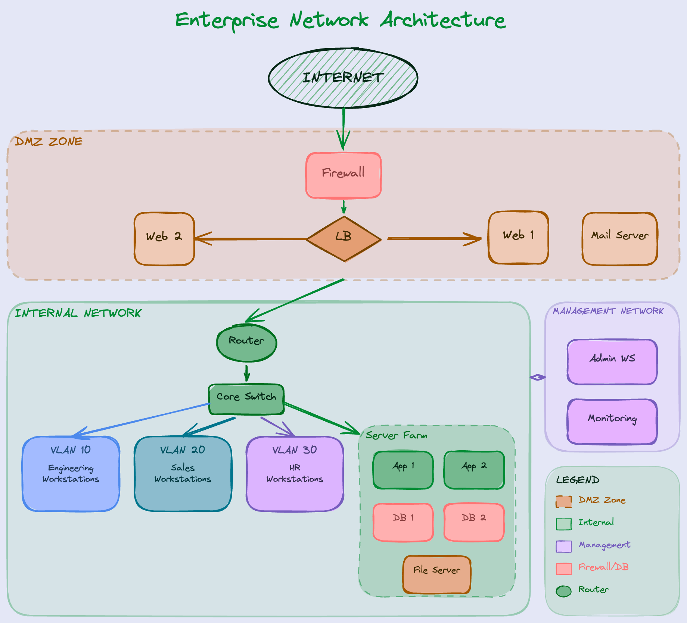

# Skills

> **Note:** This repository contains custom skills for Claude Code. For information about the Agent Skills standard, see [agentskills.io](http://agentskills.io).

## What are Skills?

Skills are folders of instructions, scripts, and resources that Claude loads dynamically to improve performance on specialized tasks. They teach Claude how to complete specific tasks in a repeatable way.

**Related Resources:**
- [What are skills?](https://support.claude.com/en/articles/12512176-what-are-skills)
- [Using skills in Claude](https://support.claude.com/en/articles/12512180-using-skills-in-claude)
- [How to create custom skills](https://support.claude.com/en/articles/12512198-creating-custom-skills)

## About This Repository

This repository contains custom skills for document processing, visualization, design, development workflow, productivity, domain expertise, and cloud deployment. Each skill is self-contained in its own folder with a `SKILL.md` file containing instructions and metadata.

## Available Skills

### agent-browser

Browser automation CLI for AI agents. Navigate pages, fill forms, click buttons, take screenshots, and extract data programmatically.

**Key Features:**
- Page navigation and interaction (click, type, scroll)
- Screenshot capture and visual validation
- Form filling and data extraction
- Web application testing automation

### aipoint-brand-guide

Apply AIPoint brand guidelines to presentations, documents, and designs.

**Key Features:**
- Gradient cyan-green color palette and Inter typography
- Dark mode design system with logo guidelines
- Consistent brand identity across all artifacts

### clawpilot

ClawPilot — your OpenClaw copilot. Security-first agent skill for AI coding assistants. Self-hosted AI gateway connecting chat apps (WhatsApp, Telegram, Discord, Slack, iMessage, Signal, LINE, Matrix, Teams, Google Chat, BlueBubbles) to AI agents.

**Key Features:**
- Installation, configuration, and troubleshooting for OpenClaw gateway
- Security hardening with bundled audit scripts (security audit, config inspector, prompt checker, session scanner)
- Multi-agent routing, session management, and agent isolation
- Cloud deployment guides (AWS, GCP, Fly.io, Docker) and remote access (Tailscale/SSH)
- Channel setup for 14+ chat platforms
- ClawHub skill discovery and installation

### crisp-reading

CRISP Reading — AI deep reading companion. Analyzes books and produces interactive HTML reading reports.

**Three ways to read:**

| Input | What happens |
|-------|-------------|
| PDF / EPUB file | Extract full text → deep analysis → HTML report |
| Book title only | Auto-search 70,000+ public domain books via Gutendex API → download full text → same deep analysis |
| Book title (not in library) | Analyze based on Claude's knowledge, clearly labeled |

The public domain library includes 444+ Chinese classics (Romance of the Three Kingdoms, Journey to the West, Dream of the Red Chamber, etc.) and tens of thousands of English works. CJK title search is fully supported.

**Key Features:**
- Integrates multiple reading methodologies (Adler, TIPS, Zettelkasten, Steel-Manning)
- TIPS four-dimension scoring (Toolability, Inspirability, Practicality, Scientificity)
- PDF/EPUB text extraction with automatic chunking for large books
- Interactive HTML report with dark mode and Copy as Markdown

### docx

Comprehensive Word document creation, editing, and analysis.

**Key Features:**
- Tracked changes workflow and comment support
- Formatting preservation during edits
- Text extraction with pandoc integration

### document-to-markdown

Convert documents and URLs to clean Markdown for LLM/RAG use.

**Supported Formats:**
| Type | Formats |
|------|---------|
| Documents | PDF, DOCX, PPTX, XLSX |
| Images | PNG, JPG, JPEG, WEBP, TIFF (with OCR) |
| Web | HTML, URLs |
| Text | TXT, MD, CSV, JSON, XML |

**Key Features:**
- Multiple backends (pymupdf4llm for speed, marker for scanned docs)
- Batch processing with parallel execution
- RAG-optimized output format
- Structured JSON output for agent integration

### excalidraw

Create professional diagrams and visualizations using Excalidraw JSON format.

**Supported Diagram Types:**
| Category | Types |
|----------|-------|
| IT/Software | System Architecture, Microservices, API Flow, Network Topology, ER Diagram, CI/CD Pipeline |
| General | Flowchart, Mind Map, Org Chart, Timeline, Decision Tree |

**Key Features:**
- 27+ pre-downloaded component libraries (AWS, Azure, GCP, Kubernetes, etc.)
- Curated color palettes for IT/technical diagrams
- Multiple visual styles (hand-drawn, minimalist, blueprint, corporate)
- Subagent delegation pattern to prevent context exhaustion

**Example Showcase:**

The following 5 examples demonstrate the unique capabilities of this skill. Open files at [excalidraw.com](https://excalidraw.com).

#### 📦 Example 1: AWS Serverless Architecture

- ✅ **AWS official colors**: Lambda orange, DynamoDB blue, S3 green
- ✅ **Cloud architecture layout**: Users → CDN → API → Lambda → DB
- ✅ **Hand-drawn style**: Professional yet approachable



#### 🐳 Example 2: Microservices on Kubernetes

- ✅ **DevOps dark theme**: Purple accent + dark background
- ✅ **Kubernetes official blue**: #326CE5
- ✅ **Sync/Async communication**: Solid vs dashed arrows
- ✅ **Service Mesh indication**: Istio sidecar indicators



#### 🔄 Example 3: CI/CD Pipeline Flowchart

- ✅ **Flowchart symbols**: Rectangle processes, diamond decisions
- ✅ **Success/Failure paths**: Green vs red arrows
- ✅ **Stage grouping**: Build → Test → Deploy
- ✅ **Manual approval gate**: Manual Approval Gate indicator



#### 🗄️ Example 4: E-Commerce ER Diagram

- ✅ **ER diagram standard symbols**: PK/FK labels, cardinality markers
- ✅ **Crow's Foot notation**: 1:N, 1:1 relationships
- ✅ **Data-flow theme colors**: Cyan palette
- ✅ **Self-referencing relationship**: Category parent-child



#### 🌐 Example 5: Enterprise Network Topology

- ✅ **Cybersecurity dark theme**: Matrix green + dark background
- ✅ **Network zone layering**: Internet → DMZ → Internal → Management
- ✅ **VLAN color coding**: Engineering/Sales/HR each with unique colors
- ✅ **Network device icons**: Firewall, router, switch



**Usage Examples:**

| Diagram Type | Example Prompt |
|-------------|----------------|
| AWS Architecture | `Create AWS Serverless architecture: API Gateway → Lambda → DynamoDB` |
| K8s Microservices | `Design Kubernetes microservices architecture with Ingress, Pods, Service Mesh` |
| CI/CD Flow | `Draw GitLab CI/CD Pipeline with Build, Test, Deploy stages` |
| ER Diagram | `Draw e-commerce ER diagram: User, Order, Product, Payment entities` |
| Network Topology | `Draw enterprise network: Internet → DMZ → Internal Network` |

**Library Quick Reference:**

| Diagram Type | Recommended Library |
|-------------|---------------------|
| AWS Architecture | `aws-architecture-icons` |
| Azure Architecture | `azure-cloud-services` |
| GCP Architecture | `gcp-icons`, `google-icons` |
| System Design | `software-architecture`, `system-design` |
| Microservices | `software-architecture`, `kubernetes-icons` |
| Database/ER | `database`, `uml-er-library` |
| Flowchart | `flow-chart-symbols` |
| Business Process | `bpmn` |
| Network Topology | `network-topology-icons` |
| CI/CD | `devops-icons`, `technology-logos` |

### frontend-design

Create distinctive, production-grade frontend interfaces with high design quality.

**Key Features:**
- Bold design direction with typography focus
- Motion and animation strategies
- Anti-generic-AI-aesthetics approach

### model-thinking

Mental models toolkit for clearer thinking, better decisions, and problem-solving.

**Key Features:**
- Multiple response modes (Guided, Direct, Teaching)
- Domain-specific model selection across 10+ domains
- Structured analysis templates and critical checking

> **Quick Install (Claude Web):** [安裝說明](docs/install-model-thinking.md)

### obsidian-vault-manager

Obsidian vault maintenance and personal knowledge management consultant. Flexibly combines Obsidian CLI and Claude Code tools to automate vault operations.

**Key Features:**
- Vault health check and orphan note detection
- Tag cleanup and reorganization
- Map of Content (MOC) generation
- Simplified Chinese to Traditional Chinese conversion (zh-CN → zh-TW)

### pdf

Comprehensive PDF manipulation toolkit for extraction, creation, merging, splitting, and form handling.

**Key Features:**
- Multiple Python libraries (pypdf, pdfplumber, reportlab)
- OCR support for scanned documents
- Encryption/decryption and form filling

### planning-with-files

File-based planning system for complex multi-step tasks using persistent markdown files.

**Key Features:**
- Structured tracking with task_plan.md, findings.md, and progress.md
- 2-action rule and 3-strike error protocol
- Read/write decision matrix for task management

### pptx

Comprehensive PowerPoint creation, editing, and analysis.

**Key Features:**
- Read/analyze with markitdown, edit with python-pptx, create with PptxGenJS
- Template-based editing preserving layouts and styles
- Speaker notes, comments, and slide manipulation
- Multiple creation approaches for different complexity levels

### quality-check

Validation gate before marking coding tasks complete.

**Key Features:**
- IDE diagnostics error detection
- Code review validation via subagent
- Test execution with short-circuit on first failure

### remotion-best-practices

Best practices for Remotion video creation in React.

**Key Features:**
- 28 rule files covering animations, audio, assets, 3D, captions
- Timing, transitions, and text effects guidance
- Chart and data visualization in video

### skill-creator

Guide for creating effective skills that extend Claude's capabilities.

**Key Features:**
- Progressive disclosure design (metadata → SKILL.md → resources)
- 6-step creation process with validation
- Best practices for conciseness and packaging

### smart-water-treatment

Water treatment system architect for semiconductor UPW, municipal, industrial, desalination, and reuse applications.

**Key Features:**
- Process design and troubleshooting for RO, EDI, IX, UF, MBR, AOP, and more
- AI/ML modeling with PINNs and time-series models
- SCADA/OT integration with OPC UA/MQTT and IEC 62443 cybersecurity
- ESG reporting and ISA-101 HMI design

### theme-factory

Toolkit for applying professional font and color themes to artifacts.

**Key Features:**
- 10 pre-set themes (Ocean Depths, Sunset Boulevard, etc.)
- Custom theme generation on-the-fly
- Theme showcase PDF reference

### tsmc-research-notes

Semiconductor CuCMP research note organizer. Transforms analysis results into standalone, self-contained Obsidian knowledge notes from a senior fab engineer + AI expert perspective.

**Key Features:**
- First-person research narrative style
- Cross-domain knowledge transfer documentation
- Obsidian-native formatting with wikilinks and tags
- CuCMP dosing research notebook structuring

### ui-ux-pro-max

UI/UX design intelligence with comprehensive searchable database.

**Key Features:**
- 50 styles, 21 color palettes, 50 font pairings, 20 chart types
- 8 tech stacks (React, Next.js, Vue, Svelte, SwiftUI, React Native, Flutter, Tailwind)
- Pre-delivery checklist for quality assurance

### vscode-extension-uiux

Build secure, elegant, and accessible VS Code extensions with excellent UI/UX.

**Key Features:**
- Native API-first design (webviews, tree views, custom editors)
- Security patterns (CSP, message validation)
- Theme integration with VS Code CSS variables

### web-design-guidelines

Review UI code for Web Interface Guidelines compliance.

**Key Features:**
- Automated fetching of latest web design guidelines
- File-by-file compliance checking
- Terse, actionable output format

### xlsx

Spreadsheet creation, editing, and analysis with formulas, formatting, and visualization.

**Key Features:**
- Formula-driven design (no hardcoded values)
- Financial color-coding standards
- LibreOffice recalculation and error detection

### zeabur

Zeabur cloud platform deployment assistant. Manage deployments, services, domains, and templates via CLI and GraphQL API.

**Key Features:**
- Application deployment (Git, Docker, local upload, templates)
- Service management via CLI (`npx zeabur`) and GraphQL API
- Domain configuration, environment variables, and networking
- Template YAML spec creation and CI/CD pipeline setup

## Installation

### Using Skills CLI (Recommended)

```bash
# Install skills-cli first
pip install git+https://github.com/kcchien/skills-cli.git

# List available skills from this repo
skills-cli list --repo https://github.com/kcchien/skills

# Install a specific skill
skills-cli install --repo https://github.com/kcchien/skills --skills <skill-name>
```

### Manual Installation

```bash
git clone https://github.com/kcchien/skills.git
cp -r skills/packages/<skill-name> ~/.claude/skills/
```

That's it! Claude will automatically discover the skill and handle dependencies when needed.

## License

MIT License

---

# 中文說明

> **備註：** 本儲存庫包含 Claude Code 的自訂技能。關於 Agent Skills 標準，請參閱 [agentskills.io](http://agentskills.io)。

## 什麼是 Skills？

Skills 是包含指令、腳本和資源的資料夾，Claude 會動態載入以提升特定任務的表現。它們教導 Claude 如何以可重複的方式完成特定任務。

**相關資源：**
- [什麼是 Skills？](https://support.claude.com/en/articles/12512176-what-are-skills)
- [在 Claude 中使用 Skills](https://support.claude.com/en/articles/12512180-using-skills-in-claude)
- [如何建立自訂 Skills](https://support.claude.com/en/articles/12512198-creating-custom-skills)

## 關於本儲存庫

本儲存庫包含文件處理、視覺化、設計、開發工作流程、生產力、領域專業知識和雲端部署的自訂技能。每個技能都獨立存放於各自的資料夾中，並包含 `SKILL.md` 檔案描述指令和中繼資料。

## 可用技能

### agent-browser

瀏覽器自動化 CLI，專為 AI 代理設計。支援頁面導航、表單填寫、按鈕點擊、截圖擷取與資料提取。

**主要特色：**
- 頁面導航與互動（點擊、輸入、捲動）
- 截圖擷取與視覺驗證
- 表單填寫與資料提取
- 網頁應用程式測試自動化

### aipoint-brand-guide

將 AIPoint 品牌規範套用至簡報、文件與設計。

**主要特色：**
- 漸層青綠配色與 Inter 字型
- 深色模式設計系統與 Logo 規範
- 跨所有產出物維持一致品牌識別

### clawpilot

ClawPilot — OpenClaw 的 AI 副駕。安全優先的 Agent 技能，適用於所有 AI 編碼助手。自託管 AI 閘道器，連接聊天應用程式（WhatsApp、Telegram、Discord、Slack、iMessage、Signal、LINE、Matrix、Teams、Google Chat、BlueBubbles）至 AI 代理。

**主要特色：**
- OpenClaw 閘道器的安裝、設定與故障排除
- 安全強化，附帶稽核腳本（安全稽核、設定檢查、提示詞檢查、對話掃描）
- 多代理路由、工作階段管理與代理隔離
- 雲端部署指南（AWS、GCP、Fly.io、Docker）與遠端存取（Tailscale/SSH）
- 支援 14+ 聊天平台的頻道設定
- ClawHub 技能探索與安裝

### crisp-reading

CRISP Reading — AI 深度閱讀夥伴。分析書籍並產出互動式 HTML 閱讀報告。

**三種閱讀方式：**

| 輸入 | 發生什麼事 |
|------|-----------|
| PDF / EPUB 檔案 | 提取全文 → 深度分析 → HTML 報告 |
| 僅輸入書名 | 自動搜尋 70,000+ 冊公共領域書籍（Gutendex API）→ 下載全文 → 同樣的深度分析 |
| 僅書名（書庫無收錄） | 依 Claude 知識分析，報告中明確標示 |

公共領域書庫收錄 444+ 冊中文古典文學（三國演義、西遊記、紅樓夢、老殘遊記等）及數萬冊英文作品。完整支援中日韓書名搜尋。

**主要特色：**
- 整合多種閱讀分析方法論（Adler、TIPS、Zettelkasten、Steel-Manning）
- TIPS 四維度評分（工具性、啟發性、實用性、科學性）
- PDF/EPUB 文字提取，支援大型書籍自動分塊處理
- 互動式 HTML 報告，支援深色模式與 Copy as Markdown

### docx

全面的 Word 文件建立、編輯與分析。

**主要特色：**
- 追蹤修訂工作流程與註解支援
- 編輯時保留格式
- 透過 pandoc 擷取文字

### document-to-markdown

將文件和網址轉換為乾淨的 Markdown 格式，適用於 LLM/RAG。

**支援格式：**
| 類型 | 格式 |
|------|------|
| 文件 | PDF、DOCX、PPTX、XLSX |
| 圖片 | PNG、JPG、JPEG、WEBP、TIFF（支援 OCR） |
| 網頁 | HTML、URLs |
| 文字 | TXT、MD、CSV、JSON、XML |

**主要特色：**
- 多後端支援（pymupdf4llm 快速處理、marker 適合掃描文件）
- 批次處理支援平行執行
- RAG 最佳化輸出格式
- 結構化 JSON 輸出方便 Agent 整合

### excalidraw

使用 Excalidraw JSON 格式建立專業圖表和視覺化。

**支援圖表類型：**
| 類別 | 類型 |
|------|------|
| IT/軟體 | 系統架構、微服務、API 流程、網路拓撲、ER 圖、CI/CD 流程 |
| 通用 | 流程圖、心智圖、組織圖、時間軸、決策樹 |

**主要特色：**
- 27+ 預載元件庫（AWS、Azure、GCP、Kubernetes 等）
- 專為 IT/技術圖表設計的配色方案
- 多種視覺風格（手繪、極簡、藍圖、企業）
- 子代理委派模式避免上下文耗盡

**範例展示：**

以下 5 個範例展示此技能的獨特之處，可至 [excalidraw.com](https://excalidraw.com) 開啟檔案查看。

#### 📦 範例 1：AWS Serverless 架構圖

- ✅ **AWS 官方配色**：Lambda 橘、DynamoDB 藍、S3 綠
- ✅ **雲端架構佈局**：Users → CDN → API → Lambda → DB
- ✅ **手繪風格**：保持專業同時具備親和力



#### 🐳 範例 2：Microservices on Kubernetes

- ✅ **DevOps 深色主題**：紫色主調 + 深色背景
- ✅ **Kubernetes 官方藍**：#326CE5
- ✅ **同步/非同步通訊**：實線 vs 虛線箭頭
- ✅ **Service Mesh 標示**：Istio sidecar 指示器



#### 🔄 範例 3：CI/CD Pipeline 流程圖

- ✅ **流程圖符號**：矩形處理、菱形決策
- ✅ **成功/失敗路徑**：綠色 vs 紅色箭頭
- ✅ **階段分組**：Build → Test → Deploy
- ✅ **人工審核閘門**：Manual Approval Gate



#### 🗄️ 範例 4：E-Commerce ER 圖

- ✅ **ER 圖標準符號**：PK/FK 標示、基數標記
- ✅ **Crow's Foot 記法**：1:N、1:1 關聯
- ✅ **資料流主題配色**：Cyan 色系
- ✅ **自我參照關聯**：Category 父子關係



#### 🌐 範例 5：企業網路拓撲圖

- ✅ **資安深色主題**：Matrix 綠 + 深色背景
- ✅ **網路區域分層**：Internet → DMZ → Internal → Management
- ✅ **VLAN 色彩區分**：Engineering/Sales/HR 各有專屬顏色
- ✅ **網路設備圖示**：防火牆、路由器、交換器



**使用範例：**

| 圖表類型 | 提示詞範例 |
|---------|-----------|
| AWS 架構 | `建立 AWS Serverless 架構：API Gateway → Lambda → DynamoDB` |
| K8s 微服務 | `設計 Kubernetes 微服務架構，包含 Ingress、Pod、Service Mesh` |
| CI/CD 流程 | `畫 GitLab CI/CD Pipeline，包含 Build、Test、Deploy 階段` |
| ER 圖 | `畫電商系統 ER 圖：User、Order、Product、Payment 實體` |
| 網路拓撲 | `畫企業網路架構：Internet → DMZ → Internal Network` |

**元件庫快速參考：**

| 圖表類型 | 推薦元件庫 |
|---------|-----------|
| AWS 架構 | `aws-architecture-icons` |
| Azure 架構 | `azure-cloud-services` |
| GCP 架構 | `gcp-icons`, `google-icons` |
| 系統設計 | `software-architecture`, `system-design` |
| 微服務 | `software-architecture`, `kubernetes-icons` |
| 資料庫/ER 圖 | `database`, `uml-er-library` |
| 流程圖 | `flow-chart-symbols` |
| 業務流程 | `bpmn` |
| 網路拓撲 | `network-topology-icons` |
| CI/CD | `devops-icons`, `technology-logos` |

### frontend-design

建立獨特、生產等級的前端介面，具備高品質設計。

**主要特色：**
- 大膽的設計方向與字型重點
- 動態與動畫策略
- 避免 AI 通用美學

### model-thinking

心智模型工具，協助更清晰的思考、更好的決策與問題解決。

**主要特色：**
- 多種回應模式（引導式、直接式、教學式）
- 跨 10+ 領域的特定模型選擇
- 結構化分析模板與批判性檢查

> **快速安裝（Claude Web）：** [安裝說明](docs/install-model-thinking.md)

### obsidian-vault-manager

Obsidian 保管庫維運與個人知識管理顧問。靈活運用 Obsidian CLI 和 Claude Code 工具，自動選擇最佳工具來完成任務。

**主要特色：**
- 保管庫健康檢查與孤立筆記偵測
- 標籤清理與重新整理
- 內容地圖（MOC）自動生成
- 簡體中文轉繁體中文（zh-CN → zh-TW）

### pdf

全方位 PDF 操作工具，支援擷取、建立、合併、分割與表單處理。

**主要特色：**
- 多種 Python 函式庫（pypdf、pdfplumber、reportlab）
- 掃描文件 OCR 支援
- 加密/解密與表單填寫

### planning-with-files

基於檔案的規劃系統，適用於複雜多步驟任務。

**主要特色：**
- 結構化追蹤：task_plan.md、findings.md、progress.md
- 2 動作規則與 3 次錯誤協定
- 任務管理的讀寫決策矩陣

### pptx

全方位 PowerPoint 簡報建立、編輯與分析。

**主要特色：**
- 讀取分析用 markitdown，編輯用 python-pptx，建立用 PptxGenJS
- 模板編輯保留原有版面與樣式
- 講者備註、註解與投影片操作
- 多種建立方式對應不同複雜度需求

### quality-check

程式碼任務完成前的驗證關卡。

**主要特色：**
- IDE 診斷錯誤偵測
- 透過子代理進行程式碼審查
- 測試執行，首次失敗即中斷

### remotion-best-practices

Remotion（React 影片製作）最佳實踐。

**主要特色：**
- 28 個規則檔案，涵蓋動畫、音訊、素材、3D、字幕
- 時間控制、轉場與文字特效指引
- 影片中的圖表與資料視覺化

### skill-creator

建立有效 Skills 的指南，擴展 Claude 的能力。

**主要特色：**
- 漸進式揭露設計（metadata → SKILL.md → resources）
- 6 步驟建立流程與驗證
- 簡潔性與封裝的最佳實踐

### smart-water-treatment

水處理系統架構師，適用於半導體超純水、市政、工業、海水淡化及再利用應用。

**主要特色：**
- RO、EDI、IX、UF、MBR、AOP 等製程設計與故障排除
- AI/ML 建模，支援 PINNs 與時間序列模型
- SCADA/OT 整合，支援 OPC UA/MQTT 與 IEC 62443 資安
- ESG 報告與 ISA-101 HMI 設計

### theme-factory

將專業字型與配色主題套用至各種產出物的工具。

**主要特色：**
- 10 種預設主題（Ocean Depths、Sunset Boulevard 等）
- 即時自訂主題生成
- 主題展示 PDF 參考

### tsmc-research-notes

半導體 CuCMP 研究筆記整理工具。以資深廠務工程師加 AI 專家的第一人稱視角，將研究過程中的分析成果轉化為獨立、自足的 Obsidian 知識筆記。

**主要特色：**
- 第一人稱研究敘事風格
- 跨域知識傳承文件化
- Obsidian 原生格式（wikilinks 與標籤）
- CuCMP 加藥研究筆記結構化

### ui-ux-pro-max

UI/UX 設計智慧，提供全面可搜尋的資料庫。

**主要特色：**
- 50 種風格、21 種配色、50 種字型搭配、20 種圖表類型
- 8 種技術棧（React、Next.js、Vue、Svelte、SwiftUI、React Native、Flutter、Tailwind）
- 交付前品質檢查清單

### vscode-extension-uiux

建立安全、優雅且無障礙的 VS Code 擴充功能。

**主要特色：**
- 原生 API 優先設計（webview、tree view、自訂編輯器）
- 安全模式（CSP、訊息驗證）
- 整合 VS Code CSS 變數的主題系統

### web-design-guidelines

檢查 UI 程式碼是否符合 Web Interface Guidelines。

**主要特色：**
- 自動取得最新網頁設計規範
- 逐檔合規性檢查
- 簡潔可執行的輸出格式

### xlsx

試算表建立、編輯與分析，支援公式、格式與視覺化。

**主要特色：**
- 公式驅動設計（不寫死數值）
- 財務色彩編碼標準
- LibreOffice 重新計算與錯誤偵測

### zeabur

Zeabur 雲端平台部署助手。透過 CLI 和 GraphQL API 管理部署、服務、域名與模板。

**主要特色：**
- 應用程式部署（Git、Docker、本地上傳、模板）
- 透過 CLI（`npx zeabur`）和 GraphQL API 管理服務
- 域名設定、環境變數與網路配置
- 模板 YAML 規格建立與 CI/CD 管線設定

## 安裝方式

### 使用 Skills CLI（推薦）

```bash
# 先安裝 skills-cli
pip install git+https://github.com/kcchien/skills-cli.git

# 列出此 repo 的可用技能
skills-cli list --repo https://github.com/kcchien/skills

# 安裝特定技能
skills-cli install --repo https://github.com/kcchien/skills --skills <skill-name>
```

### 手動安裝

```bash
git clone https://github.com/kcchien/skills.git
cp -r skills/packages/<skill-name> ~/.claude/skills/
```

完成！Claude 會自動探索此技能，並在需要時處理相依套件。

## 授權

MIT License
